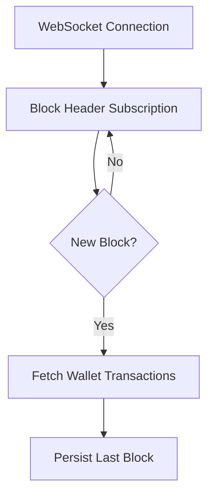

# Ethereum Wallet Tracker 🚀 [](https://golang.org/) [](https://opensource.org/licenses/MIT)

A high-efficiency Go-based solution to monitor Ethereum wallet transactions in real-time using WebSocket and Event Subscriptions. Optimized for low API usage and scalability.

**SEO Keywords**: Ethereum Transaction Tracker, Real-Time Wallet Monitoring, Go Ethereum Library, Blockchain Developer Tools, Web3 Analytics

## ✨ Features
- **Real-Time Transaction Alerts** via WebSocket
- **State Persistence** (Resumes from last processed block)
- **Error Handling & Retry Logic**
- **Low API Usage** (Avoids rate limits)
- **Docker Support** 🐳

## 🚀 Use Cases
- Crypto payment gateways
- Wallet balance monitoring
- Transaction analytics dashboards
- Fraud detection systems

## 📦 Prerequisites
- Go 1.20+
- [Infura Project ID](https://infura.io/) (Free tier works)
- Basic understanding of Ethereum addresses

## ⚙️ Installation
```bash
git clone https://github.com/Mostbesep/ethereum-wallet-tracker.git
cd ethereum-wallet-tracker
go mod download
```

## 🔧 Configuration
1. **Infura Setup**:  
   Replace `YOUR_PROJECT_ID` in `main.go`:
   ```go
   const infuraWSS = "wss://mainnet.infura.io/ws/v3/YOUR_PROJECT_ID"
   ```

2. **Target Wallet**:  
   Set your Ethereum address:
   ```go
   const targetAddress = "0xYourWalletAddress"
   ```

## 🏃 Running
```bash
go run main.go
```

**Expected Output:**
```
👀 Monitoring for new transactions...
🎉 New TX: 0xabc...123 | Block: 18965432
🎉 New TX: 0xdef...456 | Block: 18965433
```

## 🧠 Technical Deep Dive

### Architecture


### Key Optimizations
- **O(1) Block Processing**: Only checks new blocks
- **State File**: `last_block.txt` stores progress
- **Exponential Backoff**: Retries failed connections

### Benchmark (Mainnet)
| Metric               | Value       |
|----------------------|-------------|
| API Calls per Hour   | ~60         | 
| Memory Usage         | <50 MB      |
| Latency              | 1-2 seconds |

## 🤝 Contributing
1. Fork the repository
2. Create a feature branch (`git checkout -b feature`)
3. Commit changes (`git commit -am 'Add feature'`)
4. Push to branch (`git push origin feature`)
5. Open a Pull Request

## 📄 License
MIT License - See [LICENSE](LICENSE)
